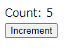

## ESモジュール版Reactを試してみた

[skypack.dev](https://cdn.skypack.dev)が提供する、[ESモジュール版React](https://cdn.skypack.dev/react)を利用すると、ブラウザから動的にReactモジュールを読み込んで表示することができます。

React公式ページ[既存のウェブサイトに React を追加する](https://ja.reactjs.org/docs/add-react-to-a-website.html)の手順でも同じことができますが、
Reactの機能がグローバルに公開されているのが気になるのでESモジュール版を利用した手順を作成しました。


### 特徴
* htmlファイル単独でReactを実行することができます
* 単独のhtmlファイルに記載してあるので、エクスプローラーからダブルクリックで実行できます(httpサーバはなくても動きます)
* jsxが使えないので、あまり実用的ではないです・・・(トランスパイルしていないので)
  * ⇒[babel-standalone](https://babeljs.io/docs/en/babel-standalone)で動的にトランスパイルするコードもつけました

### ①ボタンをクリックするとカウントアップするサンプル

よくあるごく簡単なサンプルプログラムが、htmlファイル単独で動くようになりました。



```html
<!DOCTYPE html>
<head>
  <meta charset="utf-8">
  <title>React jsx-esm-standalone</title>
  <script type="module">
    // CDN経由でReactを読み込む(ESModuleであればブラウザから直接利用可能)
    import React, { useState } from "https://cdn.skypack.dev/react";
    import ReactDOM from "https://cdn.skypack.dev/react-dom";

    const Counter = () => {
      const [count, setCount] = useState(0);
      const handleClick = () => setCount((n) => n + 1);
      return (
        // jsxが使えないのでReact.createElement()を直接呼び出す
        React.createElement(React.Fragment, null,
          React.createElement("div", null, "Count: ", count),
          React.createElement("button", {onClick: handleClick}, "Increment"))
      );
    };
    ReactDOM.render(React.createElement(Counter), document.getElementById('app'));
  </script>
</head>
<body>
  <div id="app"></div>
</body>
</html>
```

### ②jsxを使えるように[babel-standalone](https://babeljs.io/docs/en/babel-standalone)で動的にトランスパイルする

&lt;script&gt;タグの中身を.jsファイルに分離して、トランスパイルするのが面倒なので
[babel-standalone](https://babeljs.io/docs/en/babel-standalone)を利用して、htmlファイル内でjsxを利用できるように変更します。

```html
<!DOCTYPE html>
<head>
  <meta charset="utf-8">
  <title>React jsx-esm-standalone</title>
  <script src="https://unpkg.com/@babel/standalone/babel.min.js"></script>
  <!-- @babel/standaloneでESModuleを利用するために、data-type="module"を追加 -->
  <script type="text/babel" data-type="module">
    // CDN経由でReactを読み込む(ESModuleであればブラウザから直接利用可能)
    import React, { useState } from "https://cdn.skypack.dev/react";
    import ReactDOM from "https://cdn.skypack.dev/react-dom";

    const Counter = () => {
      const [count, setCount] = useState(0);
      const handleClick = () => setCount((n) => n + 1);
      return (
        <>
          <div>Count: {count}</div>
          <button onClick={handleClick}>Increment</button>
        </>
      );
    };
    ReactDOM.render(<Counter />, document.getElementById('app'));
  </script>
</head>
<body>
  <div id="app"></div>
</body>
</html>
```

